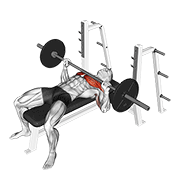

<div align="center">

# 健身动作数据集

<p>
  
  
  
  
  
  
</p>

**一个可直接使用的健身动作数据集，包含 1,324 个动作。每个动作都带有动画 GIF、180×180 缩略图、分类、身体部位、器械、目标肌肉、肌群数据，以及 6 种语言的分步动作说明（英语、西班牙语、意大利语、土耳其语、俄语、中文）。**

[](data/exercises.json)
[](videos/)
[](images/)
[](#概览)
[](https://github.com/hasaneyldrm/logpress-public)
[](LICENSE)

</div>

> **用于 [LogPress](https://github.com/hasaneyldrm/logpress-public) 应用**：这是一个 AI 辅助训练记录应用，本仓库是它的动作数据层。你也可以把它直接接入自己的健身应用后端。

---

## 数据来源

**本仓库提供：**

- 1,324 个健身动作，包含分类、身体部位、器械、目标肌肉和肌群数据
- 每个动作一张动画 GIF 和一张 180×180 缩略图（媒体 © [Gym visual](https://gymvisual.com/)，见[许可证与使用](#许可证与使用)）
- 6 种语言的分步动作说明：英语、西班牙语、意大利语、土耳其语、俄语、中文
- 可交互浏览器页面（`index.html`）和开发者接入指南（`setup.html`）

---

## 目录

- [数据来源](#数据来源)
- [概览](#概览)
- [交互式浏览器与开发者设置](#交互式浏览器与开发者设置)
- [文件结构](#文件结构)
- [统计信息](#统计信息)
- [数据结构](#数据结构)
- [示例动作](#示例动作)
- [使用示例](#使用示例)
- [许可证与使用](#许可证与使用)

---

## 概览

这是一个面向教育、研究和应用开发整理的 **1,324 个健身动作** 数据集。它覆盖多种肌群、器械和动作类型，适合用于：

- 构建健身、训练计划或动作库应用
- 动作识别、动作推荐等机器学习项目
- 健康与运动研究
- 教学演示和产品原型

每条动作记录包含：

| 字段 | 说明 |
|---|---|
| 唯一 ID | 数字标识符，例如 `"0001"` |
| 名称 | 动作的描述性英文名称 |
| 分类 | 主要训练的身体部位 |
| 目标肌肉 | 主要目标肌肉 |
| 肌群 | 协同或辅助肌群 |
| 器械 | 所需器械，徒手动作为 `body weight` |
| 动作说明 | 每个动作的分步说明 |
| 可用语言 | 英语 · 西班牙语 · 意大利语 · 土耳其语 · 俄语 · 中文 |
| 媒体 | 每个动作都有 180×180 缩略图（`image`）和动画 GIF（`gif_url`），媒体 © Gym visual |

---

## 交互式浏览器与开发者设置

本仓库包含两个可直接打开的 HTML 工具，不需要启动服务器。

> **说明：** 浏览器页面会展示每个动作的 180×180 缩略图、动画 GIF、元数据和动作说明。

### `index.html`：动作浏览器

一个完全前端运行的动作浏览器，支持：

- 在全部 1,324 个动作中实时搜索
- 按分类、器械和目标肌肉筛选
- 无限滚动网格
- 点击卡片查看完整详情，并可切换英语、西班牙语、意大利语、土耳其语、俄语或中文动作说明

### `setup.html`：开发者接入指南

帮助你把数据集集成到自己的应用中：

1. **数据库设置**：为 SQL Server、PostgreSQL、MySQL 和 SQLite 提供 `CREATE TABLE` SQL。还可以在浏览器中生成包含 1,324 条 `INSERT` 语句的 `.sql` 文件。
2. **API 集成**：提供 JavaScript、Python、C#、Java、PHP、Go 和 cURL 示例，演示如何调用你的后端 API。输入基础 URL 后，示例会实时更新。
3. **让 LLM 生成后端**：选择框架和数据库后复制结构化提示词，可粘贴到 ChatGPT、Claude、Gemini 等模型中，一次生成完整的 REST API。支持 Express.js、FastAPI、ASP.NET Core、Spring Boot、Laravel 和 Gin。

---

## 文件结构

```text
exercises-dataset/
├── data/
│   └── exercises.json       # 完整数据集：1,324 条动作记录（JSON 数组）
├── images/                  # 1,324 张 180×180 缩略图（© Gym visual）
├── videos/                  # 1,324 张 180×180 动画 GIF（© Gym visual）
├── index.html               # 交互式动作浏览器（纯前端，无需服务器）
├── setup.html               # 开发者接入指南（数据库导入 + API 集成）
├── NOTICE.md                # 媒体署名与许可条款
└── README.md
```

### 关键文件

- **`data/exercises.json`**：主数据文件。它是一个包含 1,324 个动作对象的 JSON 数组，带有完整元数据。`image` / `gif_url` 指向本地 180×180 资源；每条记录都包含 `attribution` 字段，`media_id` 保存原始媒体引用 ID。
- **`images/`、`videos/`**：180×180 缩略图和动画 GIF（© [Gym visual](https://gymvisual.com/)，经许可使用）。
- **`index.html`**：独立动作浏览器，可直接在现代浏览器中打开。
- **`setup.html`**：数据库设置、API 集成和 LLM 辅助后端生成指南。
- **`LICENSE`、`NOTICE.md`**：代码/数据使用 MIT License，媒体资源遵循 Gym visual 的授权和使用条款。

---

## 统计信息

| 指标 | 数量 |
|---|---|
| 动作总数 | **1,324** |
| 动作说明语言 | **6** |

### 按身体部位统计

| 身体部位 | 动作数量 |
|---|---|
| 上臂 | 292 |
| 大腿 | 227 |
| 背部 | 203 |
| 腰腹 | 169 |
| 胸部 | 163 |
| 肩部 | 143 |
| 小腿 | 59 |
| 前臂 | 37 |
| 有氧 | 29 |
| 颈部 | 2 |

### 按器械统计

| 器械 | 动作数量 |
|---|---|
| 徒手 | 325 |
| 哑铃 | 294 |
| 绳索器械 | 157 |
| 杠铃 | 154 |
| 杠杆器械 | 81 |
| 弹力带 | 54 |
| 史密斯机 | 48 |
| 壶铃 | 41 |
| 负重 | 36 |
| 稳定球 | 28 |
| EZ 杠铃 | 23 |
| 其他 | 83 |

> **提示：** 大约 25% 的动作完全不需要器械，非常适合居家训练应用。

---

## 数据结构

`data/exercises.json` 中每条记录遵循如下结构：

| 字段 | 类型 | 说明 |
|---|---|---|
| `id` | `string` | 唯一数字标识符，例如 `"0001"` |
| `name` | `string` | 动作英文名称，例如 `"3/4 sit-up"` |
| `category` | `string` | 身体部位分类，例如 `"upper arms"`、`"chest"`、`"back"` |
| `body_part` | `string` | 目标身体部位，通常与 `category` 相同 |
| `equipment` | `string` | 所需器械，例如 `"dumbbell"`、`"body weight"` |
| `instructions.en` | `string` | 英文完整分步说明 |
| `instructions.es` | `string` | 西班牙语完整分步说明 |
| `instructions.it` | `string` | 意大利语完整分步说明 |
| `instructions.tr` | `string` | 土耳其语完整分步说明 |
| `instructions.ru` | `string` | 俄语完整分步说明 |
| `instructions.zh` | `string` | 中文完整分步说明 |
| `instruction_steps.*` | `array[string]` | 按步骤拆分的多语言动作说明 |
| `muscle_group` | `string` | 主要协同肌群 |
| `secondary_muscles` | `array[string]` | 参与动作的其他肌肉 |
| `target` | `string` | 主要目标肌肉，例如 `"biceps"`、`"pectorals"` |
| `media_id` | `string` | 原始媒体引用 ID，例如 `"2gPfomN"` |
| `image` | `string` | 180×180 缩略图路径，例如 `"images/0001-2gPfomN.jpg"` |
| `gif_url` | `string` | 180×180 动画 GIF 路径，例如 `"videos/0001-2gPfomN.gif"` |
| `attribution` | `string` | 媒体版权声明：`"© Gym visual — https://gymvisual.com/"` |
| `created_at` | `string` | 记录创建时间，ISO 8601 格式 |

### 示例记录

```json
{
  "id": "0001",
  "name": "3/4 sit-up",
  "category": "waist",
  "body_part": "waist",
  "equipment": "body weight",
  "instructions": {
    "en": "Lie flat on your back with your knees bent and feet flat on the ground. ...",
    "es": "Túmbate sobre tu espalda con las rodillas flexionadas y los pies apoyados en el suelo. ...",
    "it": "Sdraiati sulla schiena con le ginocchia piegate e i piedi appoggiati a terra. ...",
    "tr": "Sırt üstü yatın, dizlerinizi bükün ve ayaklarınızı yere düz koyun. ...",
    "ru": "Лягте на спину, согните колени и поставьте ступни на землю. ...",
    "zh": "平躺，膝盖弯曲，双脚平放在地上。..."
  },
  "muscle_group": "hip flexors",
  "secondary_muscles": ["hip flexors", "lower back"],
  "target": "abs",
  "media_id": "2gPfomN",
  "image": "images/0001-2gPfomN.jpg",
  "gif_url": "videos/0001-2gPfomN.gif",
  "attribution": "© Gym visual — https://gymvisual.com/",
  "created_at": "2026-03-18T12:31:32.854798+00:00"
}
```

---

## 示例动作

> 每个示例都包含 180×180 缩略图（`image`）和动画 GIF（`gif_url`），媒体 © [Gym visual](https://gymvisual.com/)。

### 1：杠铃卧推 · 胸部


> **器械：** 杠铃 · **目标：** 胸肌 · **辅助：** 肱三头肌、肩部 · **媒体 ID：** `EIeI8Vf`

杠铃卧推是胸部训练的核心动作，也是力量举“三大项”之一。动作过程中，训练者仰卧在卧推凳上，将负重杠铃下降到胸部，再发力推起。它会同时募集胸肌、肱三头肌和前三角肌，是发展上肢推力和胸部肌肉量的高效动作。

**动作要点：** 出杠前先收紧并下沉肩胛。双脚踩稳地面，下背保持自然拱起，握距约与肩同宽。受控下降到胸部中段，再通过脚跟稳定发力向上推起。

### 2：杠铃硬拉 · 大腿 / 背部


> **器械：** 杠铃 · **目标：** 臀肌 · **辅助：** 腘绳肌、下背部 · **媒体 ID：** `ila4NZS`

杠铃硬拉常被视为最全面的全身力量动作。它几乎会调动后链的主要肌群，包括臀肌、腘绳肌和下背部，同时也需要上背、斜方肌和握力共同参与。良好的脊柱排列和核心支撑对表现和安全都很关键。

**动作要点：** 起始时让杠铃位于足中线正上方。髋部后折，双手握在腿外侧，强力收紧核心，全程让杠铃贴近小腿。想象把地面推开，顶端夹紧臀部并完全伸髋完成锁定。

### 3：杠铃深蹲 · 大腿


> **器械：** 杠铃 · **目标：** 臀肌 · **辅助：** 股四头肌、腘绳肌、小腿、核心 · **媒体 ID：** `qXTaZnJ`

杠铃深蹲要求下肢和核心高度协同发力。相比半程深蹲，蹲过平行更能刺激臀肌和腘绳肌。它也是多数力量和增肌训练计划的基础动作。

**动作要点：** 杠铃可放在上斜方肌（高杠）或后三角附近（低杠）。下蹲前收紧核心，膝盖沿脚尖方向打开，坐入髋部，下降到大腿低于平行位置。通过全脚掌发力站起。

### 4：哑铃肱二头肌弯举 · 上臂


> **器械：** 哑铃 · **目标：** 肱二头肌 · **辅助：** 前臂 · **媒体 ID：** `NbVPDMW`

哑铃弯举是最常见的手臂孤立训练动作。单侧独立训练有助于发现和纠正左右力量差异。掌心向上的旋后握法可以在动作顶端最大化肱二头肌收缩。

**动作要点：** 身体站直，肘部贴近身体两侧。弯举时逐渐旋后手腕，在顶端收缩，然后受控下放，避免借助肩部或下背摆动。

### 5：引体向上 · 背部


> **器械：** 徒手 · **目标：** 背阔肌 · **辅助：** 肱二头肌、前臂 · **媒体 ID：** `lBDjFxJ`

引体向上是上肢拉力训练的经典徒手动作。它主要发展背阔肌，有助于塑造 V 形背部，同时也会大量调用肱二头肌、后三角肌和核心稳定肌群。它可以从弹力带辅助版本逐步进阶到负重版本。

**动作要点：** 采用正握悬垂，握距与肩同宽或略宽。先通过背阔肌下沉肩胛，再将胸部拉向横杠。每次下放到充分伸展，保持完整活动范围。

### 6：哑铃侧平举 · 肩部


> **器械：** 哑铃 · **目标：** 三角肌 · **辅助：** 斜方肌 · **媒体 ID：** `DsgkuIt`

哑铃侧平举是增加肩宽的常用孤立动作，主要针对三角肌中束。相比重量，节奏控制和标准姿势更重要。

**动作要点：** 全程保持肘部微屈。将哑铃向身体两侧抬起至手臂与地面平行即可，不要过高。用肘部带动动作，而不是手腕。下放时保持控制，增加肌肉受力时间。

---

## 使用示例

### Python：读取和筛选

```python
import json

with open("data/exercises.json", "r", encoding="utf-8") as f:
    exercises = json.load(f)

print(f"Total exercises loaded: {len(exercises)}")

# 按分类筛选
chest_exercises = [ex for ex in exercises if ex["category"] == "chest"]
print(f"Chest exercises: {len(chest_exercises)}")
# -> Chest exercises: 163

# 按器械筛选
bodyweight = [ex for ex in exercises if ex["equipment"] == "body weight"]
print(f"Bodyweight exercises: {len(bodyweight)}")
# -> Bodyweight exercises: 325

# 获取所有分类
categories = sorted({ex["category"] for ex in exercises})
print("Categories:", categories)

# 访问多语言动作说明
ex = exercises[0]
print(ex["instructions"]["en"])  # 英语
print(ex["instructions"]["es"])  # 西班牙语
print(ex["instructions"]["it"])  # 意大利语
print(ex["instructions"]["tr"])  # 土耳其语
print(ex["instructions"]["ru"])  # 俄语
print(ex["instructions"]["zh"])  # 中文
```

### Python：使用 Pandas 读取

```python
import json
import pandas as pd

with open("data/exercises.json", "r", encoding="utf-8") as f:
    data = json.load(f)

df = pd.DataFrame(data)

# 查看动作数量最多的分类
print(df["category"].value_counts().head(10))

# 找出所有使用杠铃、目标为大腿的动作
barbell_quads = df[(df["equipment"] == "barbell") & (df["category"] == "upper legs")]
print(barbell_quads[["name", "target", "equipment"]])
```

### JavaScript / Node.js

```js
const exercises = require("./data/exercises.json");

console.log(`Total exercises: ${exercises.length}`);

// 只筛选徒手动作
const bodyweight = exercises.filter(ex => ex.equipment === "body weight");
console.log(`Bodyweight exercises: ${bodyweight.length}`);
// -> Bodyweight exercises: 325

// 按分类分组
const byCategory = exercises.reduce((acc, ex) => {
  acc[ex.category] = (acc[ex.category] || []);
  acc[ex.category].push(ex);
  return acc;
}, {});

// 访问多语言动作说明
const ex = exercises[0];
console.log(ex.instructions.en); // 英语
console.log(ex.instructions.es); // 西班牙语
console.log(ex.instructions.it); // 意大利语
console.log(ex.instructions.tr); // 土耳其语
console.log(ex.instructions.ru); // 俄语
console.log(ex.instructions.zh); // 中文
```

### TypeScript：类型安全用法

```typescript
interface Exercise {
  id: string;
  name: string;
  category: string;
  body_part: string;
  equipment: string;
  instructions: {
    en: string;
    es: string;
    it: string;
    tr: string;
    ru: string;
    zh: string;
  };
  muscle_group: string;
  secondary_muscles: string[];
  target: string;
  media_id: string | null;
  image: string | null;
  gif_url: string | null;
  attribution: string;
  created_at: string;
}

import exercises from "./data/exercises.json";
const data = exercises as Exercise[];

const randomWorkout: Exercise[] = data.slice(0, 6);
console.log("First 6 exercises:", randomWorkout.map(e => e.name));
```

---

## 许可证与使用

本仓库包含一个**开发者设置向导和结构化健身动作数据集**，内容包括动作元数据、多语言动作说明翻译，以及 180×180 动作媒体资源。

- **代码、工具、数据结构和动作说明文本** 使用 [MIT License](LICENSE) 发布。
- **动作媒体（图片和 GIF）归 © [Gym visual](https://gymvisual.com/) 所有**，并在许可下以 180×180 分辨率随仓库再分发。请阅读 [`NOTICE.md`](NOTICE.md) 和 [`LICENSE`](LICENSE) 中的媒体例外条款，并保留 `© Gym visual — https://gymvisual.com/` 署名。媒体复用受 [Gym visual Terms & Conditions](https://gymvisual.com/content/3-terms-and-conditions-of-use) 约束；在自己的项目中复用前，请按需向 Gym visual 获取授权。
- 本仓库不声明对底层动作内容或媒体资源拥有所有权。
